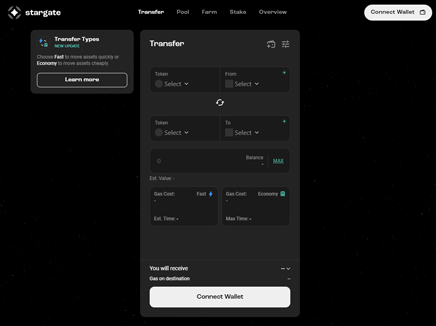
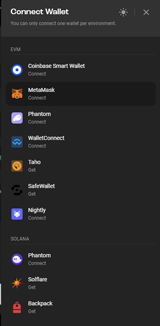
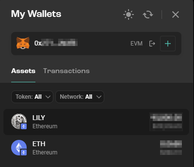
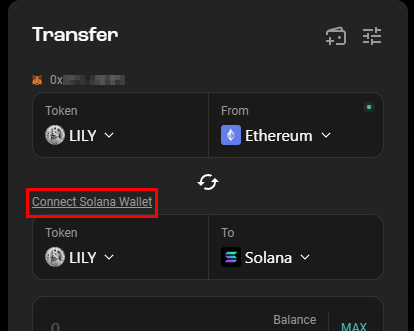
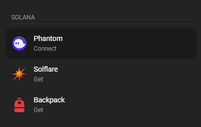
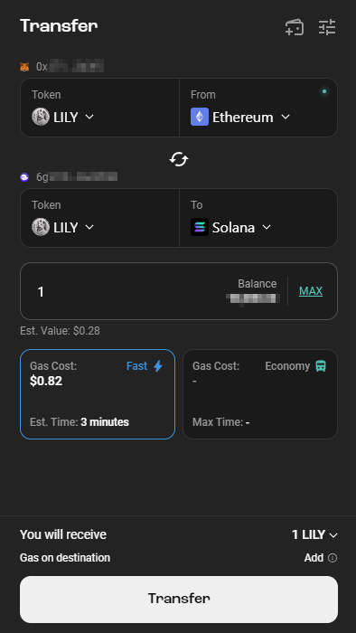
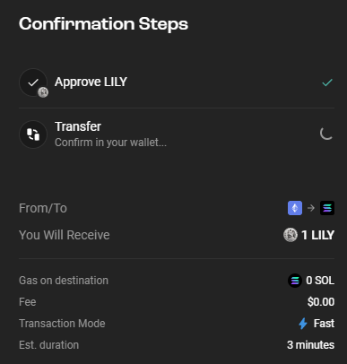
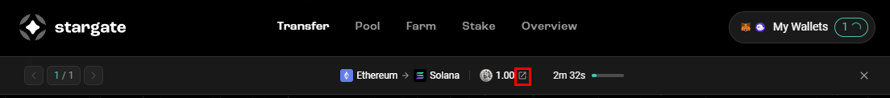
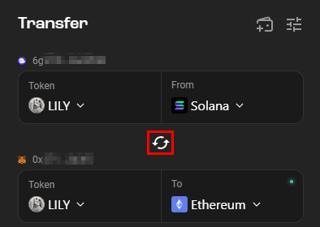

## Lily's Coin Contract Addresses

Ethereum CA: **0x7ce89243cc0d9e746609c57845eccbd9bb4b7315**

Solana CA: **Co5WwGeZfpfqGE1tUyAp1SBjcmumoY9sNN99MXRbX98K**

## Transferring LILY from Ethereum to/from Solana

1. Go to https://stargate.finance/bridge

2. Click "Connect Wallet" and select your wallet (i.e. Metamask)

3. Select the LILY token from the list.

4. Click on "Connect Solana Wallet" and select your wallet from the list (i.e. Phantom)

5. Enter the amount of LILY you wish to send and click on "Transfer" at the bottom.

6. You will then be taken a transaction preview screen and you will need to confirm transactions in your wallet when prompted.

7. Your transfer will then appear at the top of the page. If you click on the icon next to the amount, you will be taken to [Layerzeroscan](https://layerzeroscan.com/) where you can view the transaction details and status in real time.

8. To send from Solana to Ethereum instead, click on the "Arrow Icon" to swap the source and destination.

